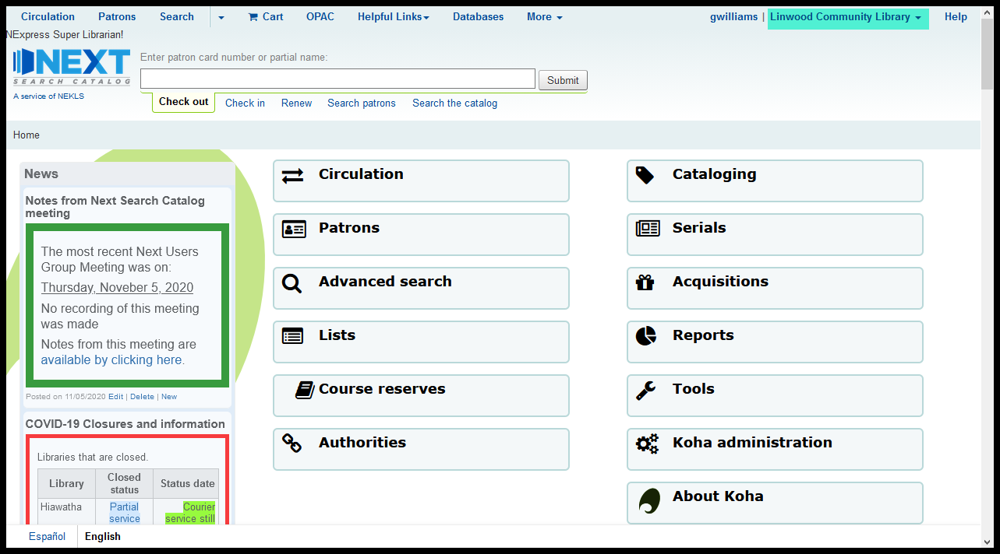
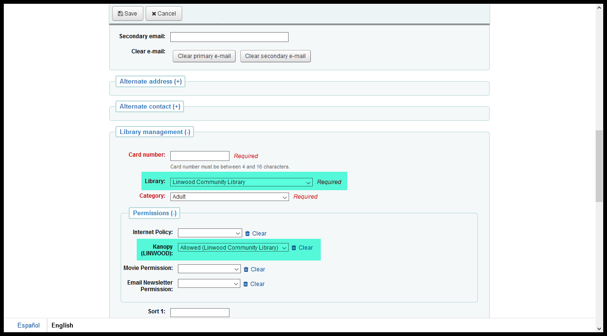
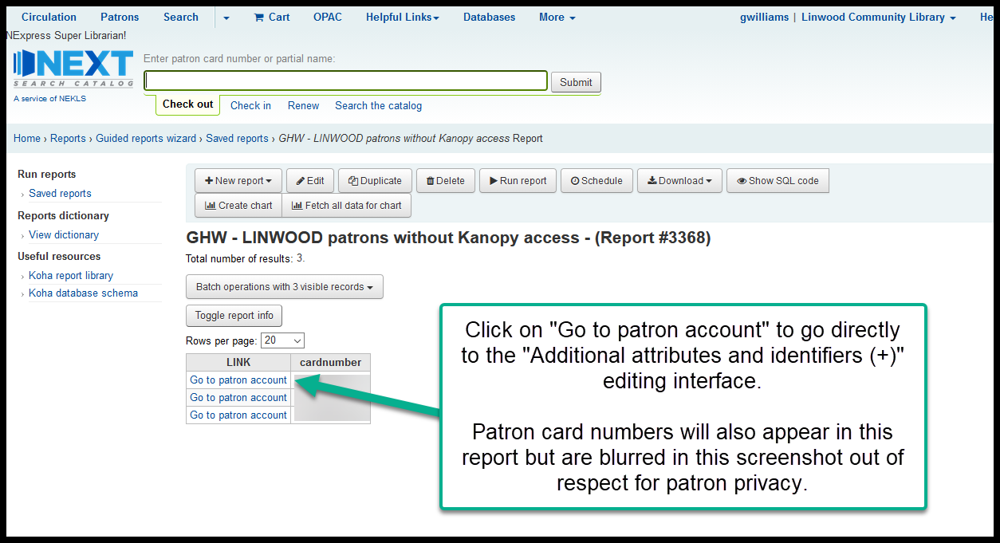
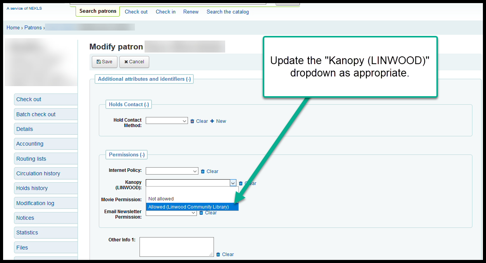
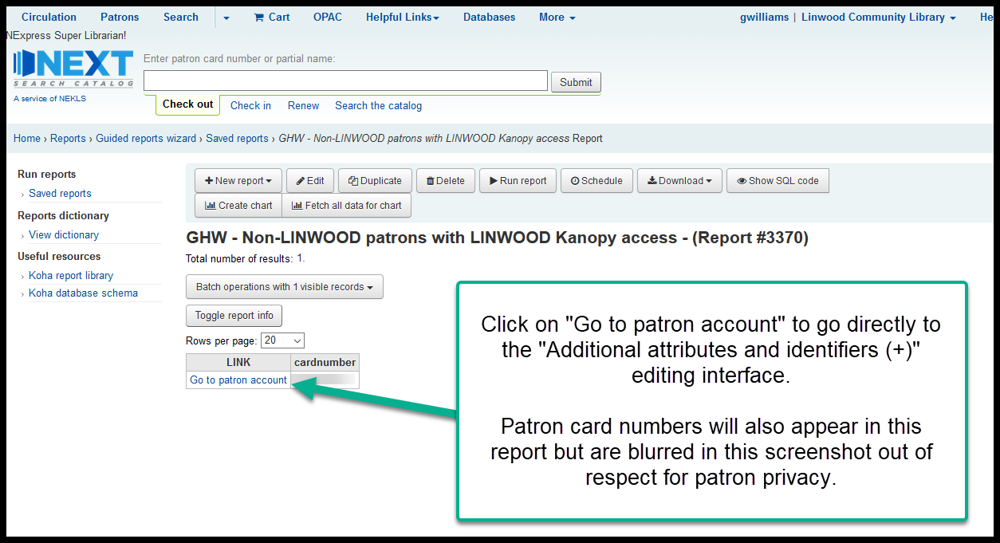

Extra patron attribute needed for Kanopy at LINWOOD
===================================================

Whenever a patron logs into an outside service like Kanopy or Hoopla or Lynda.com, that web service talks to our catalog through a connection called SIP2 to verify that the patron has an account and that they are allowed to access their service.  The information that is transmitted across this connection includes some parts of the patron's contact information including the patron's home library.  The problem we have with Kanopy, however, is that, because of the way the receiving end of the Kanopy SIP2 connection is configured, Kanopy cannot determine what the patron's home library is through the normal SIP2 process.  Because of this, we need to send the patron's home library through an alternate route.  To make this happen, we've created a new field in the "Permissions" section on a patron's account called "Kanopy (LINWOOD)."

The new "Kanopy (LINWOOD)" permission will have 3 options

- [blank]
- Not allowed
- Allowed (Linwood Community Library)

These three options will only be available to staff logged in at LINWOOD in order to prevent staff at other libraries from granting permission to access the Linwood Community Library's Kanopy service to their patrons.

This will affect staff and patrons in two ways:

#. When staff at LINWOOD create a new account for a patron, the patron's "Kanopy (LINWOOD)" permission needs to be set to "Allowed (Linwood Community Library)" if their home library is LINWOOD or "Not allowed" if their home library is not LINWOOD.  This should happen automatically when a new patron is created.
#. If staff at another library change a patron's home library, staff at LINWOOD will need to update the patron's "Kanopy (LINWOOD)" settings to "Allowed (Linwood Community Library)" if the patron's new home library is LINWOOD or"Not allowed" if the patron's new home library is no longer LINWOOD.  This process cannot happen automatically because only LINWOOD staff have access to the "Kanopy (LINWOOD)" permission settings.  Reports will be set up to help LINWOOD staff manage this process.

Creating a new account
----------------------

When logged in at Linwood Community Library, click on "Patrons"

Then click on the appropriate category on the "New patron" button

.. image:: ../LINWOOD/images/kanopy.linwood.020.png

Then go through your normal process for creating a new patron

.. image:: ../LINWOOD/images/kanopy.linwood.030.png

By default, the patron's home library should be set to LINWOOD and the patron's "Kanopy (LINWOOD)" permission should, by default, be set to "Linwood Community Library"

If you change the patron's home library from to anything besides LINWOOD, the "Kanopy (LINWOOD)" permission should automatically switch to "Not allowed"

.. only:: html

   .. image:: ../LINWOOD/images/kanopy.linwood.050.gif

However, if you chage a patron's "Kanopy (LINWOOD)" permission manually, the patron's home library will not update automatically.

Running reports to manually update Kanopy Permission
----------------------------------------------------

LINWOOD patrons without Kanopy access
^^^^^^^^^^^^^^^^^^^^^^^^^^^^^^^^^^^^^

If a new patron with a LINWOOD home library is added at a library not logged in as LINWOOD, the new patron's "Kanopy (LINWOOD)" settings will be left blank and the patron will not be able to access Kanopy.  In order to identify these patrons, staff at LINWOOD will need to regularly run report 3368.

Non-LINWOOD patrons with Kanopy access
^^^^^^^^^^^^^^^^^^^^^^^^^^^^^^^^^^^^^^

If an existing patron who has Kanopy access changes their home library, that patron's Kanopy access needs to be removed from their account manually.  If the change to their account happens and staff is not logged in at LINWOOD, staff will not be able to remove the "Kanopy (LINWOOD)" status.  In order to identify these patrons, staff at LINWOOD will need to regularly run REPORT # NEEDED.

..
  [TODO] Needs reports, report numbers, and all screenshots updated.
