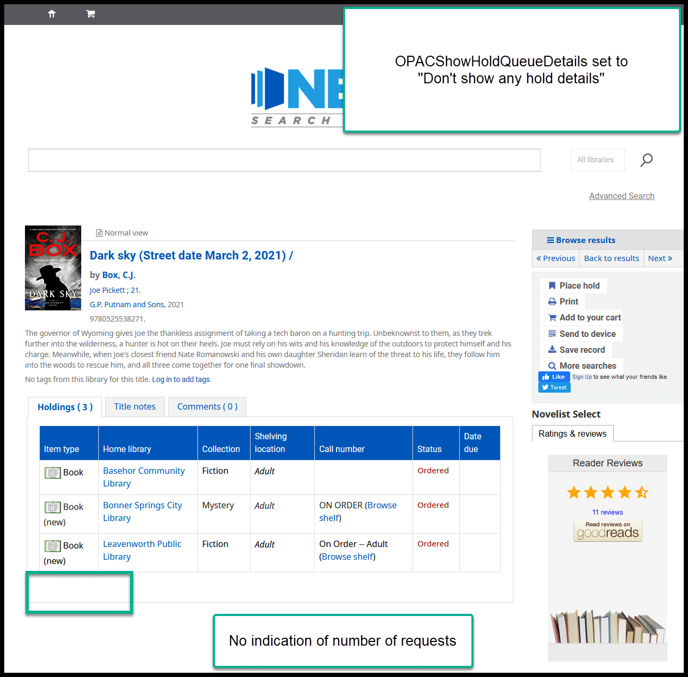
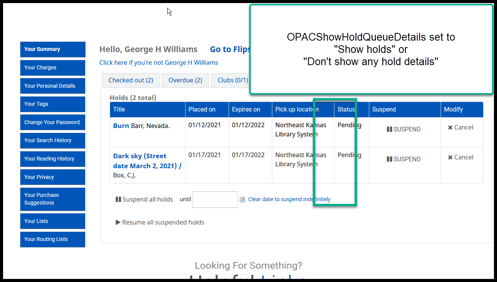
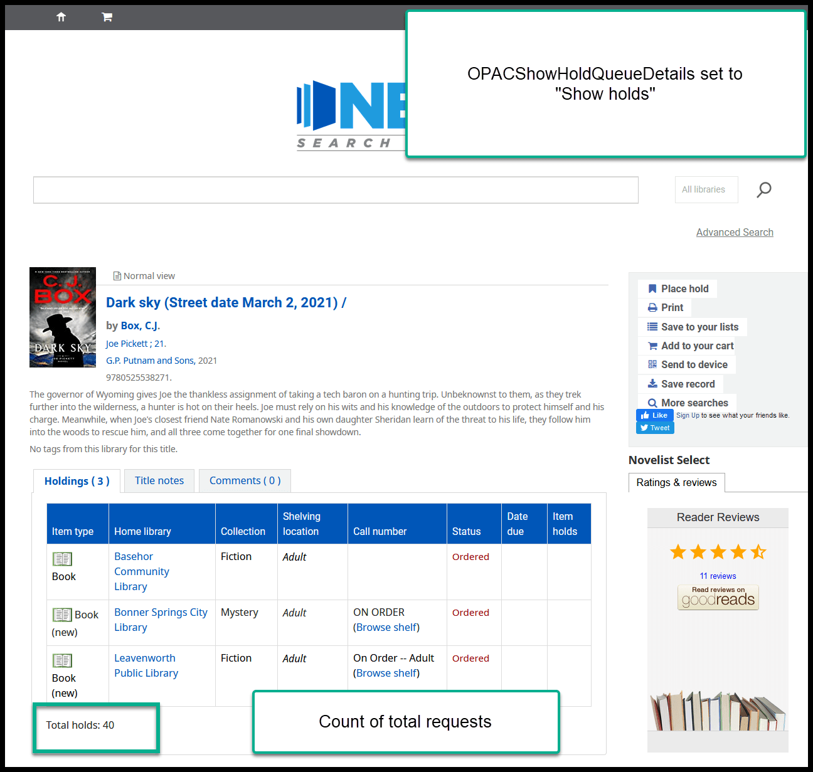
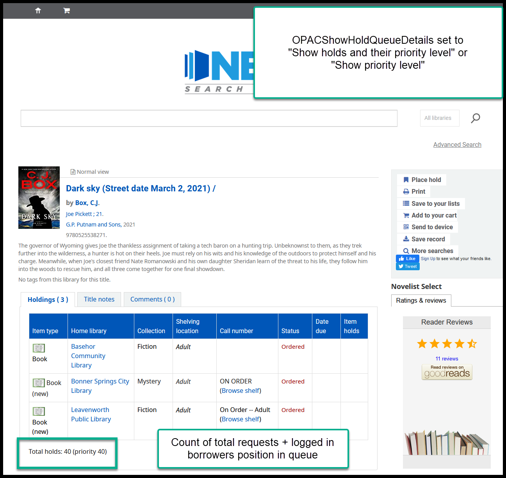
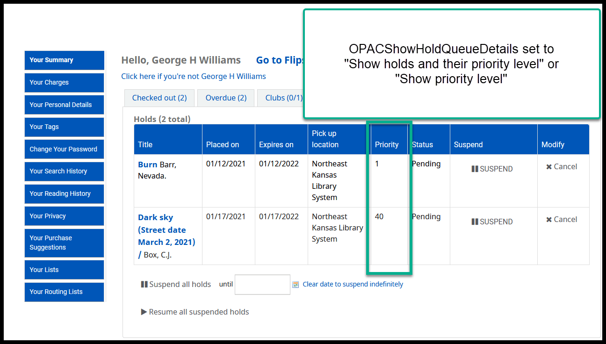

Proposal to change OPACShowHoldQueueDetails
===========================================

There is a system preference in Koha called "OPACShowHoldQueueDetails."

The options for this preference are:

- Don't show any hold details
- Show holds
- Show holds and their priority level
- |ss| Show prioity level |se| (bug - doesn't work correctly)

Currently this preference is set to "Don't show any hold details."  This means that, on the item record in the OPAC, there is no indication of how many requests there may be on any title.

History
-------

This system preference has been set this way since 2014 or 2015.  At that time there was a bug that was scrambling the request queue every time a request was filled.  This caused the requests queues to be filled out of order.  As a stop-gap measure, Heather manually re-ordered the holds queues using data from a report she ran every evening (George was doing the same thing in Idaho at that time).  Borrowers were upset when they noticed that their requests were being filled out of order, therefore, this preference was set to "Don't show any hold details" so that borrowers would stop complaining about the problem that was out of our control.  This bug was resolved within 3-4 months of its appearance, but this system preference has never been changed back in Next Search Catalog.

In the meantime, a new system preference was added to the system called "LocalHoldsPriority."  This is the system preference that tells Koha to give priority for filling requests when the pickup library matches the item's home library.  In other words, if someone requests that an item to be picked up at PAOLA and PAOLA owns a copy of that item, the PAOLA copy will fill the PAOLA request - even if there are requests closer to the top of the holds queue.  This means that if your library doesn't own a copy of an item that is in high demand, requests to pick up that item at your library will almost certainly be filled out of order.

Proposal
--------

It's been proposed that we change how this system preference operates.  On January 21, NEKLS will send a survey to the Next Search Catalog library directors asking if this system preference should be set to:

- Don't show any hold details (no change)
- Show holds
- Show holds and their priority level

-----

This is how this system preference affects what borrowers see in the OPAC:

Currently on the OPAC details page
----------------------------------

Currently on a borrower's Holds tab

-----

Changing to "Show holds" would result in this combination
---------------------------------------------------------

"Show holds" on the details page

"Show holds" on the Holds tab

-----

Changing to "Show holds and their priority level" would result in this combination
----------------------------------------------------------------------------------

"Show holds and their priority level" on the details page

"Show holds and their priority level" on the Holds tab

-----

The voting on this issue will remain open until March 19, 2021.

.. |ss| raw:: html

    <strike>

.. |se| raw:: html

    </strike>

.. |br| raw:: html

     
