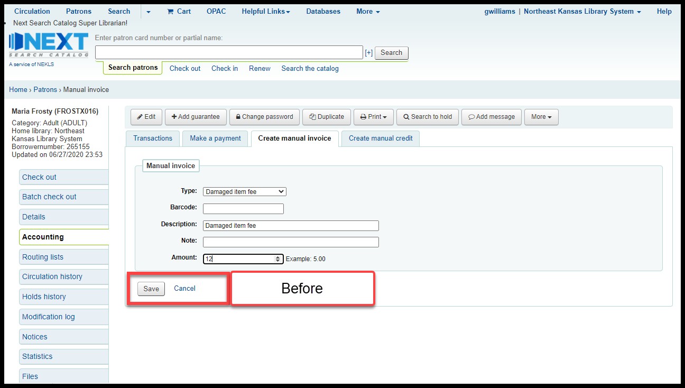
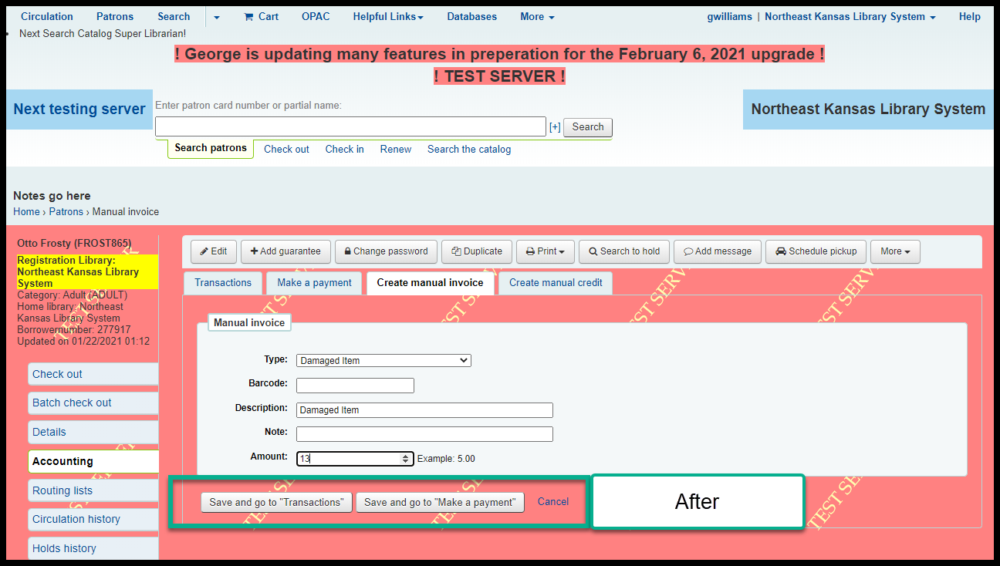
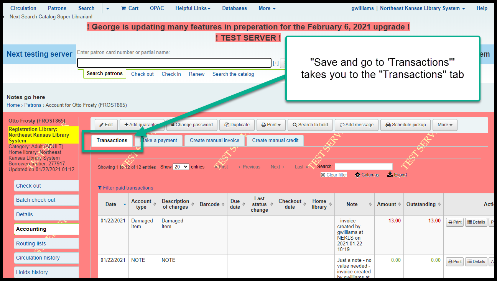
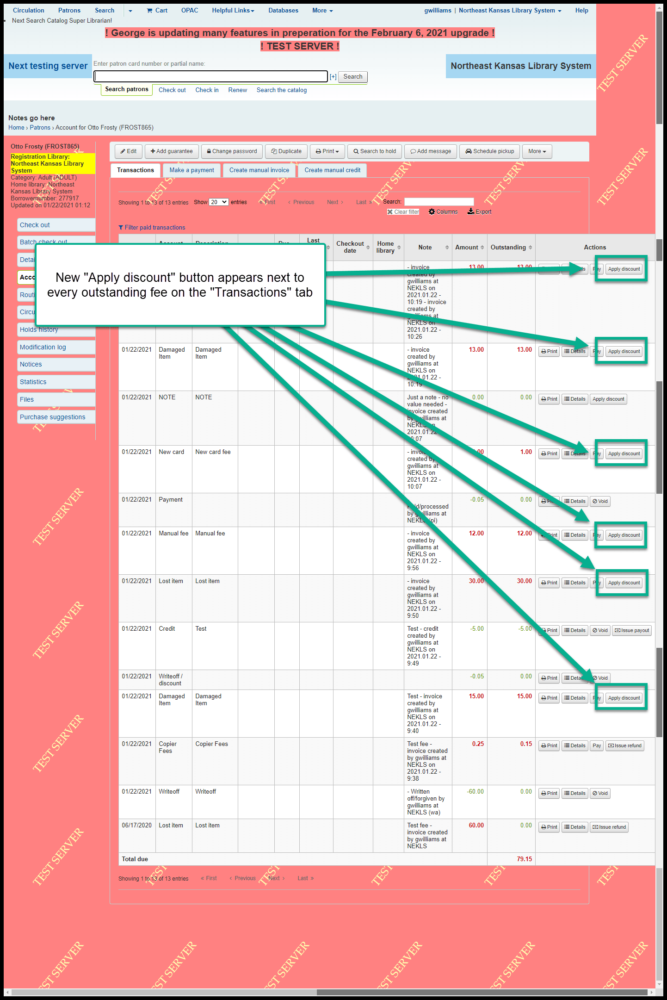
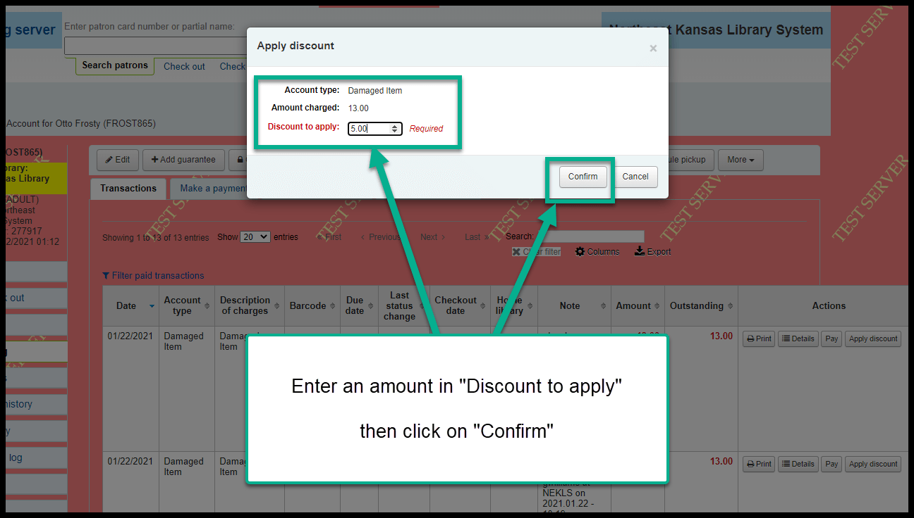
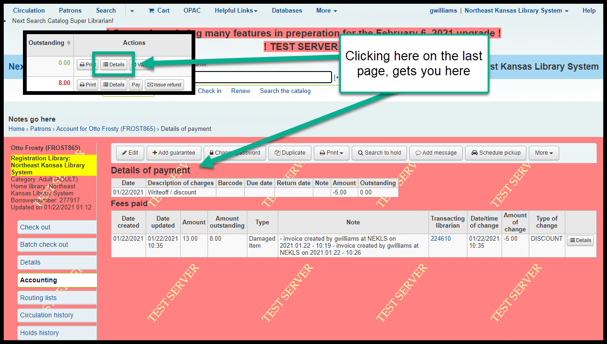
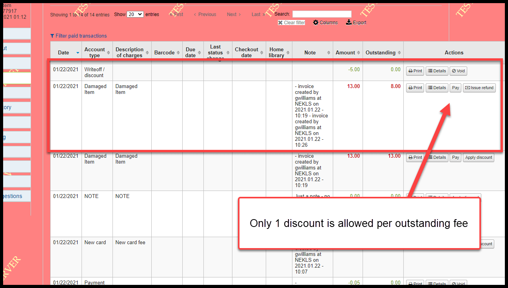
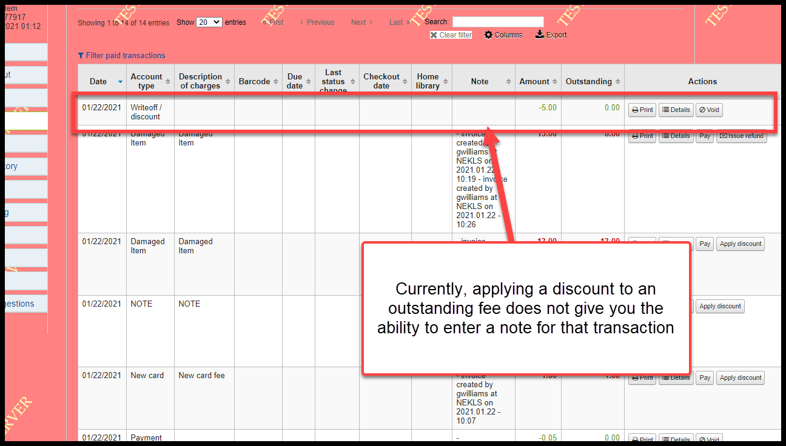
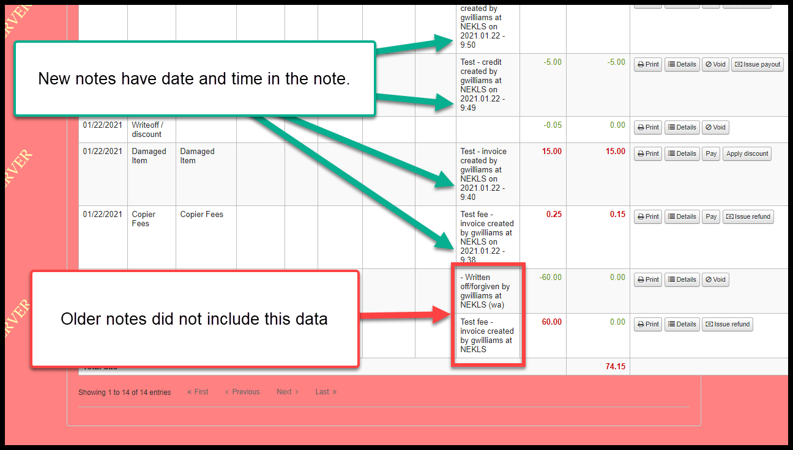

Accounting / fees changes
==========================

Apply credit function improved
^^^^^^^^^^^^^^^^^^^^^^^^^^^^^^

Several credit related bugs have been fixed and the "Apply credit" feature has been improved.

In previous versions, "Apply credit" appeared as a link instead of a button and it didn't always work correctly.  These issues appear to have been resolved.

.. image:: ../../images/accounting.0010.png

Additionally, situations arose in the last version where borrowers were sometimes billed for late fees and lost items and the order in which credits were applied to their accounts when those items were returned were not done in the proper order.  Depending on the circumstances of a transaction, a credit may have been created before fees were applied which caused unresolvable fees and credits.  This problem seems to have bene resolved.

Manual invoice
^^^^^^^^^^^^^^

Old "Save" button - before:

New "Save and go to 'Transactions'" and "Save and go to 'Make a payment'" buttons - after:

Clicking on "Save and go to 'Transactions'" takes you here:

Clicking on "Save and go to 'Make a payment'" takes you here:

.. image:: ../../images/accounting.0050.png

There is work being done to make "Save and go to 'Make a payment'" take you straight to the "Pay individual fee" page for the specific invoice you've just created.

"Apply discount" button on "Transactions" tab
^^^^^^^^^^^^^^^^^^^^^^^^^^^^^^^^^^^^^^^^^^^^^

This is a brand new button that allows you to remove part of an individual fee - much like doing a partial write-off from the "Make a payment" tab.

Clicking on "Apply discount" opens a pop-up window that allows you to forgive/writeoff/remove all or part of the outstanding fee:

After applying a discount, there will be a new line indicating "Writeoff/discount" as the payment type.

.. image:: ../../images/accounting.0080.png

Clicking on the "Details" button on a "Writeoff/discount" line will show you details about the discount.

Once you apply a discount to an outstanding fee, no further discounts can be applied.

Currently "Apply discount" does not allow for the creation of a "Note" but this may change in the future.

Automatic notes enhancement
^^^^^^^^^^^^^^^^^^^^^^^^^^^

Automatic notes made from the "Make a payment," "Create manual invoice," and "Create manual credit" tabs now include the date and time the transaction happened:

