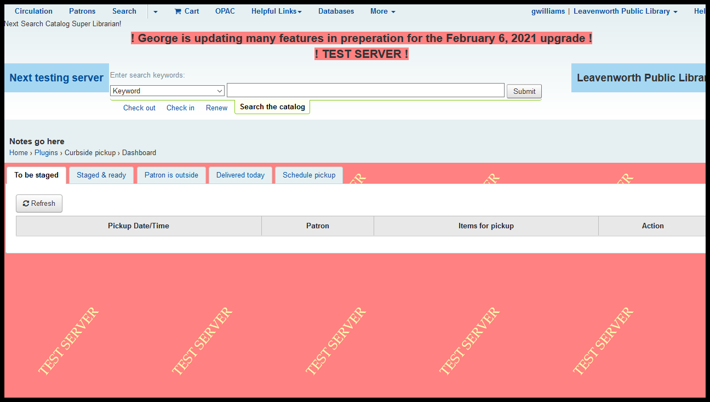
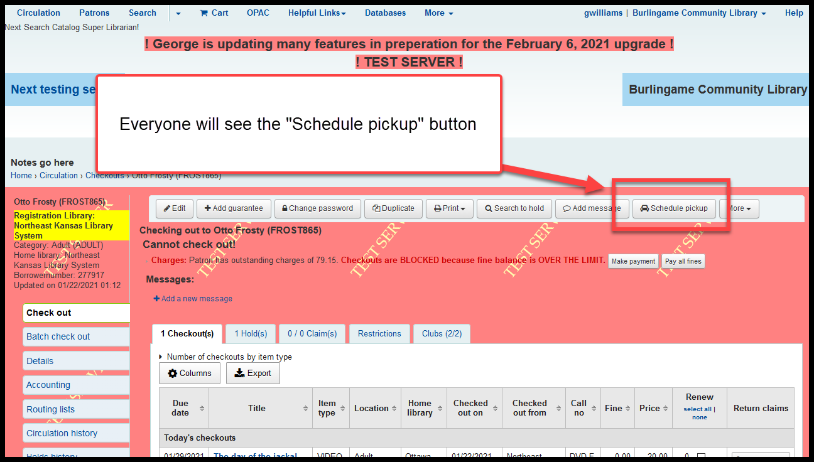
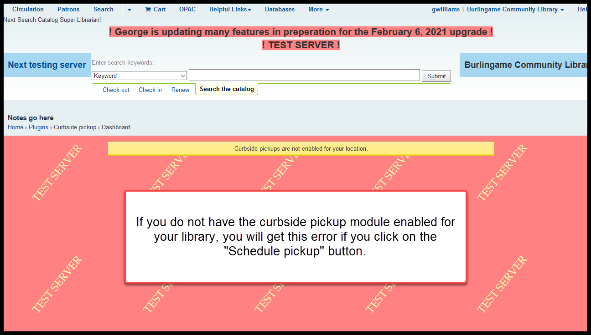

Changes to discuss on a library-by-library basis
================================================

Individual library control of some parts of the OPAC
^^^^^^^^^^^^^^^^^^^^^^^^^^^^^^^^^^^^^^^^^^^^^^^^^^^^

It was our hope that we could turn over full control of this feature to library directors, but due to some bugs, that is looking problematic.

The advantage of this feature is that it allows libraries that may subscribe to services such as Tutor.com or Kanopy to put links to those services on the home page of the OPAC when borrowers with the same home library are logged into the catalog.

When a borrower is not logged in:

..
  [todo] screenshot needed

When a borrower is logged in:

..
  [todo] screenshot needed

Curbside plugin
^^^^^^^^^^^^^^^

Koha now has a "Curbside pickup" module.

It allows borrowers to request curbside pickup through the OPAC.  It allows them to schedule a time for pickup via the OPAC.  It allows them to use the OPAC to notify the library that they have arrived and are waiting.

It allows staff to mark requested items for a patron as "To be staged," "Staged & ready," or "Patron is outside." When items are at the "Patron is outside" part of the process, it allows staff to check out all of the materials that are "Staged and ready" with 1 click.  It also allows staff to configure pickup hours, pickup times, and schedule borrower for picup times.

This module requires extensive set up and training.  Rather than train everyone, NEKLS will wait until a library asks for this module to be set up.

Regardless of whether or not you are using the curbside plugin, all staff will see a "Schedule pickup" button when checking out material to a borrower:

Recent item-type changes
^^^^^^^^^^^^^^^^^^^^^^^^

Item types were recently added for:

+--------------------+----------------------------------------------------+
|Item type code      |Item type description                               |
+====================+====================================================+
|NELECT              |Tablets, e-readers , and personal computing devices |
+--------------------+----------------------------------------------------+
|NREL_ART            |Artwork                                             |
+--------------------+----------------------------------------------------+
|NREL_BIKE           |Bicycle                                             |
+--------------------+----------------------------------------------------+
|NREL_CLOTH          |Cloting, costumes, and masks                        |
+--------------------+----------------------------------------------------+
|NREL_COOK           |Cooking equipment                                   |
+--------------------+----------------------------------------------------+
|NREL_TOOL           |Tools                                               |
+--------------------+----------------------------------------------------+
|NREL_TOY            |Board games, dolls, puzzles, and toys               |
+--------------------+----------------------------------------------------+
|NSOFT               |Software                                            |
+--------------------+----------------------------------------------------+

If your library wants to use any of these item types, you must contact NEKLS to set up circulation rules before you start using them.
