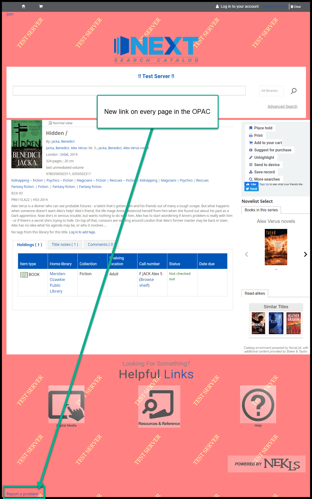
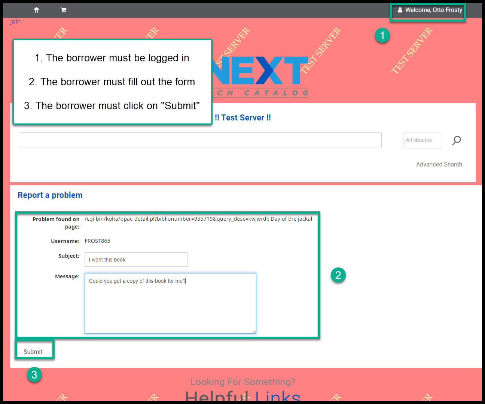
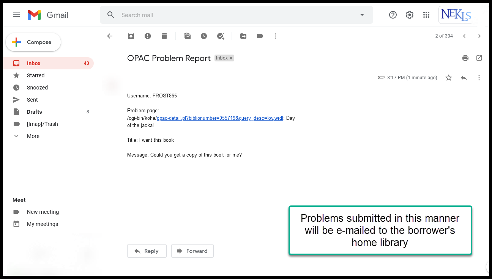
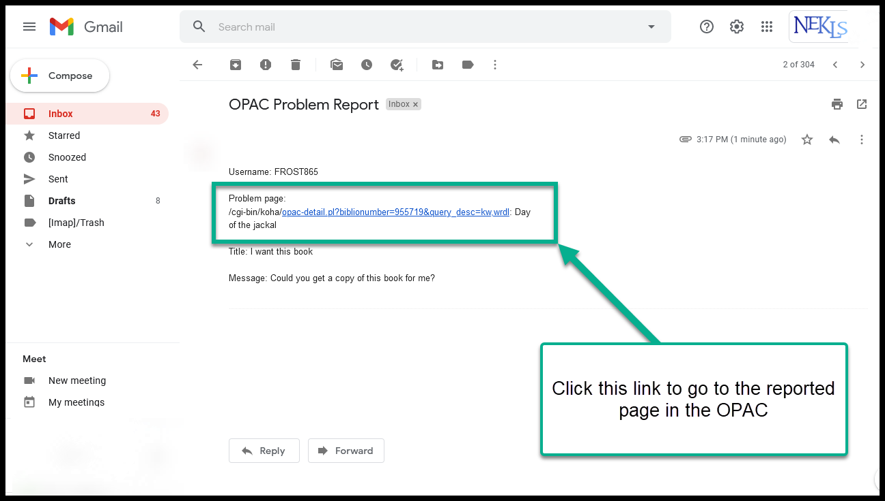
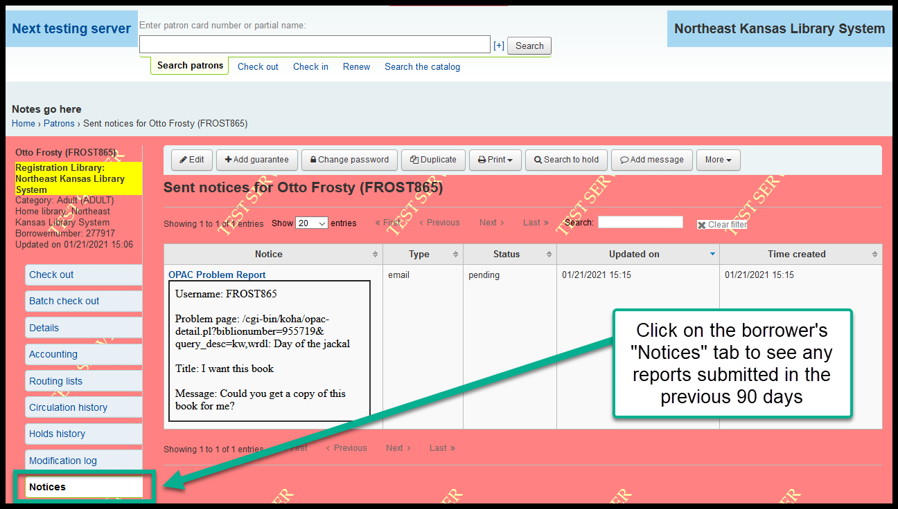
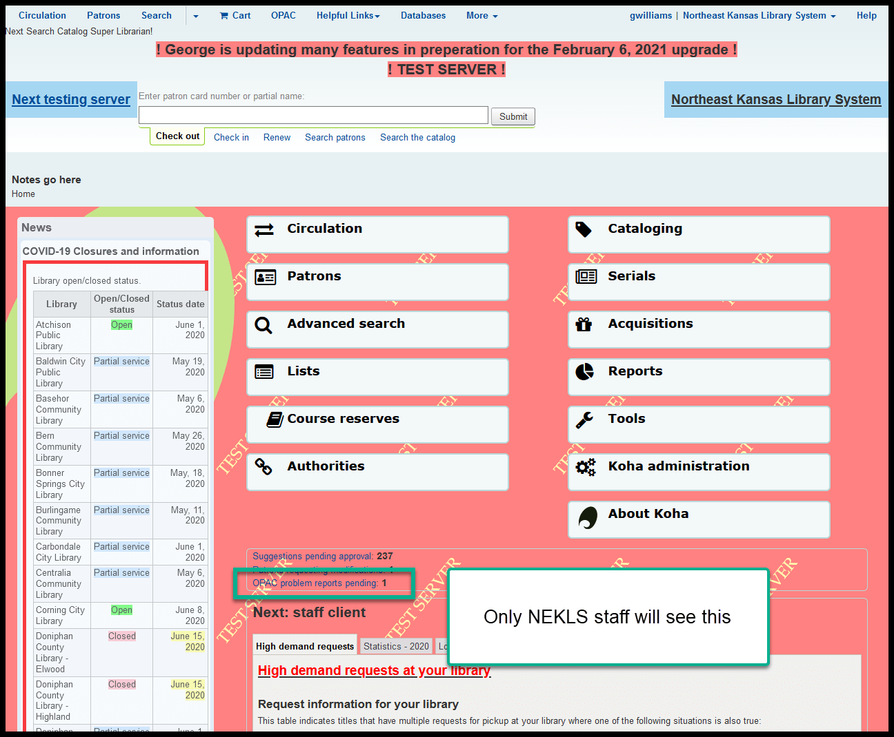

Report a problem with an OPAC page
===================================

**This is a brand new feature for the OPAC in Koha 20.05.**

On every page in the OPAC, on the bottom left corner of the page, a new link will appear titled "Report a problem."

The developer's intention with this feature was to create a way that borrowers could alert library administrators if there was a problem with a web page in the catalog.  We expect, however, that borrowers will use this to ask questions like "I requested this yesterday, why isn't it here yet" or "Can you order the sequel" or "I didn't like this book."  Staff at member libraries should come up with a strategy for how to deal with these e-mails - answering ones like "Why don't you order the sequel" and forwarding ones like "This cover image is upside down" to nexthelp@nekls.org.

Here's a walk-through of how this looks in the OPAC:

This link appears in the bottom left hand corner on **every** page in the OPAC:

When a borrower clicks on this link they will be taken to a new page (if they are not logged in, the borrower will be asked to log in):

When a borrower fills out this form and clicks on "Submit," the data entered in the form will be sent as an e-mail to the borrower's home library:

The e-mail that is sent to the library will include a link to the page in the OPAC from where the error was reported:

A record of that message will appear on the borrower's "Notices" tab:

NEKLS staff will be able to see any reports on the staff client home page (this will give NEKLS staff the ability to see what's going on):

https://youtu.be/j9aYOgNRFtc

-----

Video on this topic:
--------------------

Watch a YouTube video about reporting a page problem.

.. only:: html

  .. raw:: html

        <iframe width="560" height="315" src="https://www.youtube.com/embed/ctYgbeI6aHk" frameborder="0" allow="accelerometer; autoplay; clipboard-write; encrypted-media; gyroscope; picture-in-picture" allowfullscreen></iframe>

.. only:: latex

   https://youtu.be/ctYgbeI6aHk

-----

.. |ss| raw:: html

    <strike>

.. |se| raw:: html

    </strike>

.. |br| raw:: html

     
