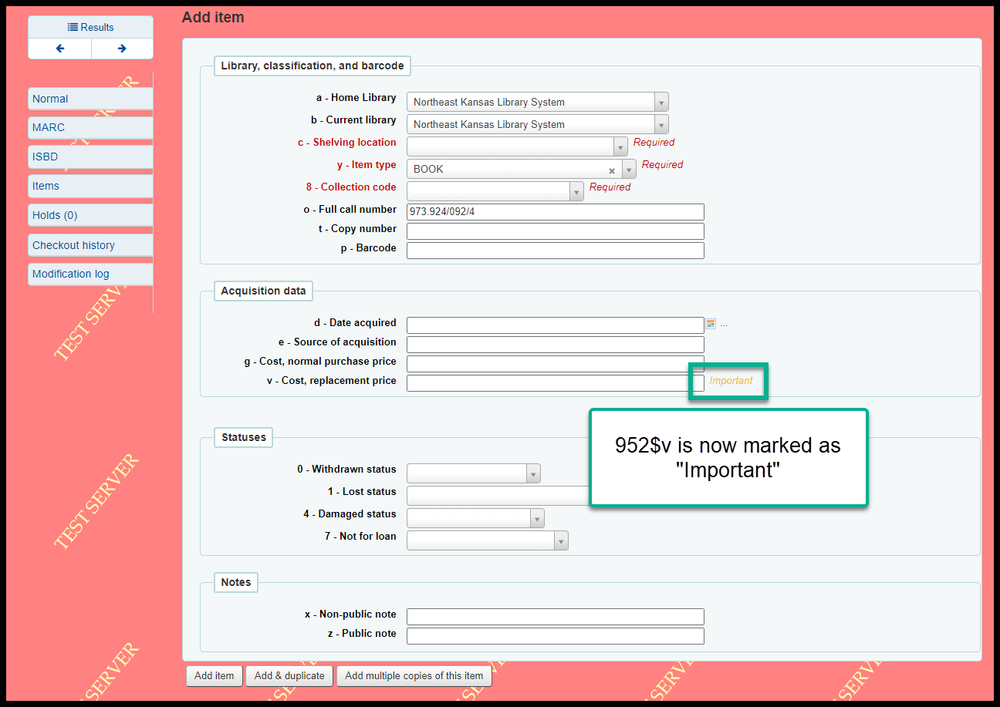
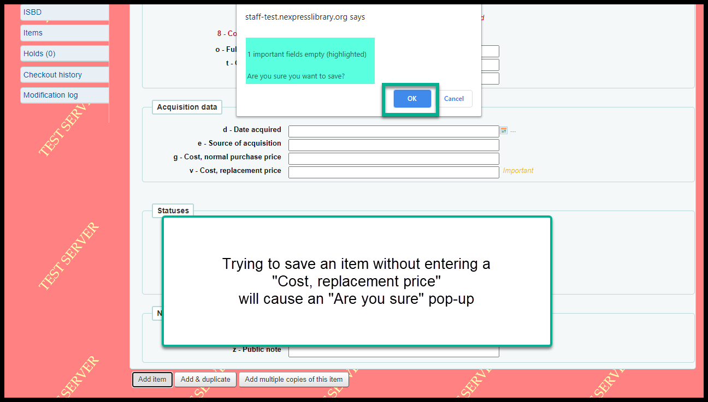
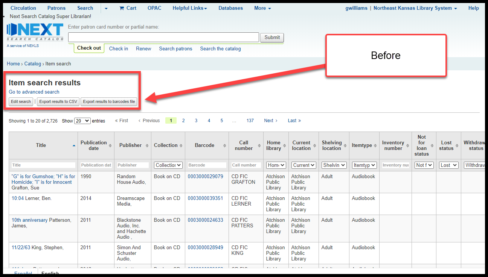
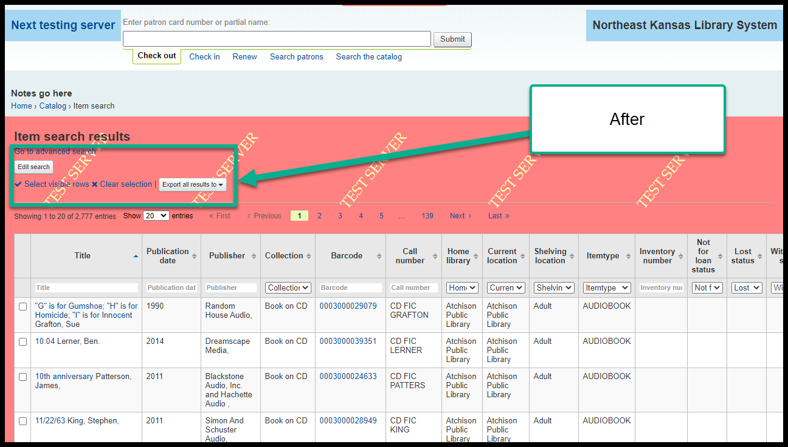
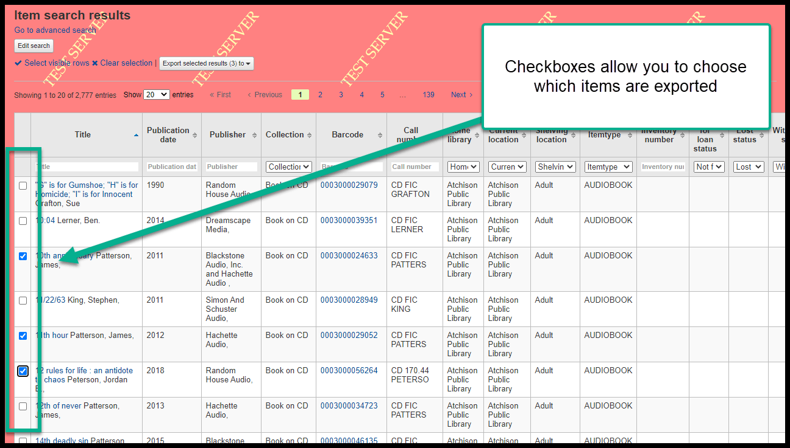
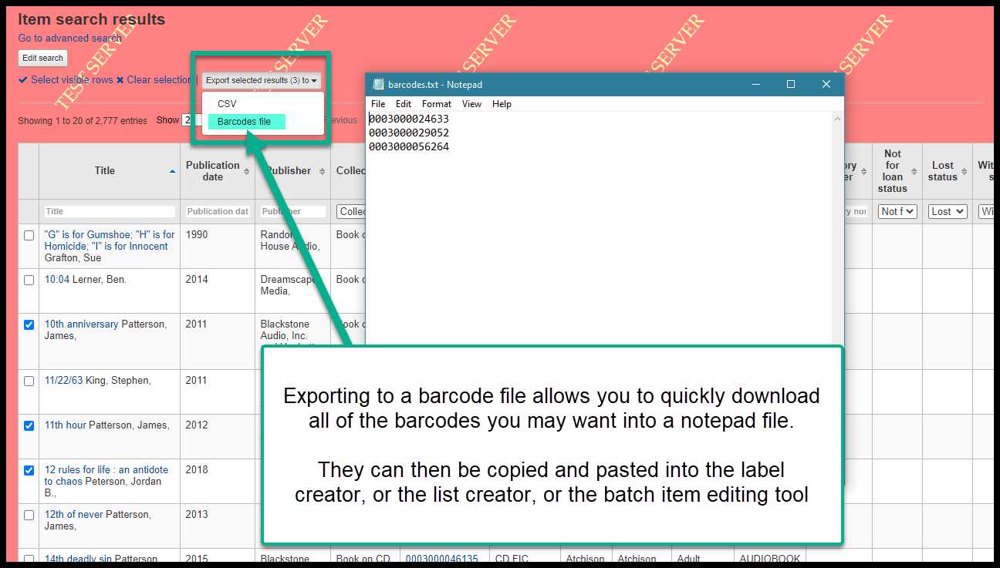
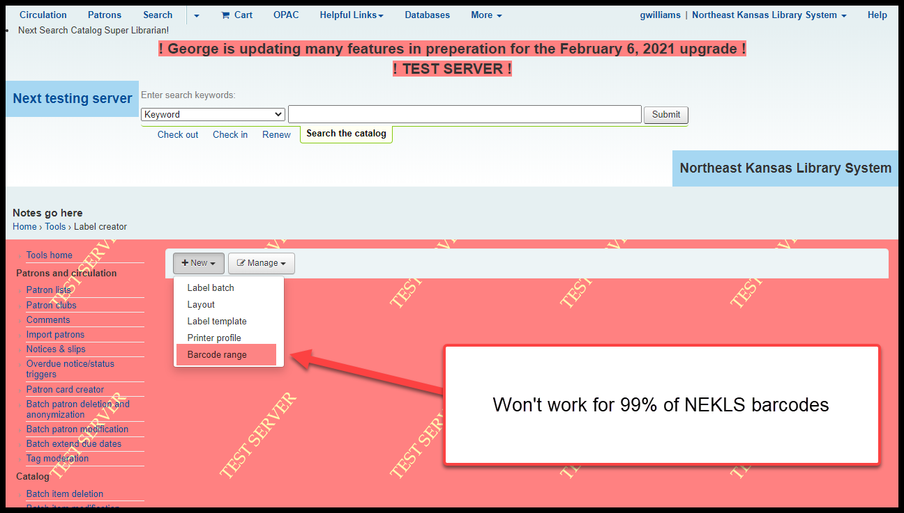

3 Cataloging/Technical Services Changes
========================================

952$v will be marked as "Important"
^^^^^^^^^^^^^^^^^^^^^^^^^^^^^^^^^^^

The 952$v is the "Cost, replacement price" field in an item record.  If this field is left empty, a borrower can not be automatically billed for the cost of the item if it is marked as "Lost (more than 45 days overdue)."  Marking the field as "Important" means that, if you try to save an item record with a blank "Cost, replacement price" a warning message will pop-up when you try to save the item record.  Unlike a required field, you will still be able to save the item record.  But first you will be warned that the field is blank.

Item search output
^^^^^^^^^^^^^^^^^^

Checkboxes are now available on the item search page.  The "Export" button has also been compacted.

Before:

After

New checkboxes allow you to select items individually for export:

The "Export" button can allow you to send the barcode numbers from your results to a notepad file.  The barcode numbers could then be used for batch editing or creating a list of items.

Create labels by barcode number range
^^^^^^^^^^^^^^^^^^^^^^^^^^^^^^^^^^^^^

I strongly recommend against using this feature because it will not work for libraries that have non-numeric barcode numbers **or** barcode numbers that start with zeroes.

This means, that, there are virtually no libraries in Next Search Catalog that can use this feature.

-----

Video on this topic:
--------------------

Watch a YouTube video about reporting a page problem.

.. only:: html

  .. raw:: html

        <iframe width="560" height="315" src="https://www.youtube.com/embed/ysdc6m7DJOM" frameborder="0" allow="accelerometer; autoplay; clipboard-write; encrypted-media; gyroscope; picture-in-picture" allowfullscreen></iframe>

.. only:: latex

   https://youtu.be/ysdc6m7DJOM

-----
